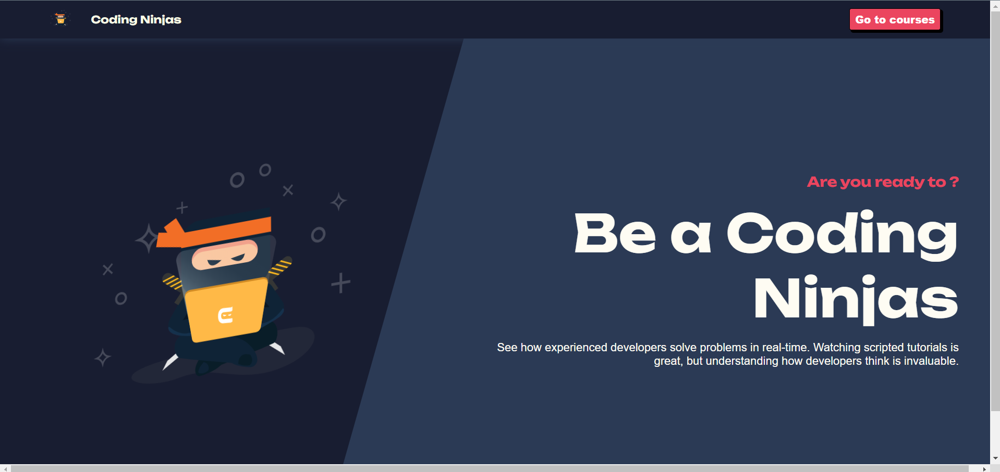

# E-Learning Platform

This is an E-Learning platform built with React. It allows users to browse and learn various courses. The platform is designed to provide a seamless learning experience with a user-friendly interface and interactive content. Users can explore a wide range of courses, view detailed information about each course, and learn through structured chapters that include videos and other resources. 

## Project Features

- **Hero Section**: The landing page with a welcoming message.
- **Navigation**: A navigation bar to switch between different sections.
- **Courses**: A list of available courses.
- **Course Details**: Detailed information about each course.
- **Learn**: A section to learn the chapters of a course.
- **Chapter**: Detailed information about each chapter including videos.

## Dependencies

- `react`
- `react-dom`
- `react-router-dom`

## Folder Structure

- **components**: Contains reusable components like Button, Card, ErrorToast, Loader, and Nav.
- **context**: Contains the Theme context for managing light and dark themes.
- **data**: Contains the courses data in JSON format.
- **pages**: Contains the main pages of the application like Hero, Courses, Details, Learn, and Chapter.

## How to Use

1. Clone the repository.
2. Install the dependencies using `npm install`.
3. Run the application using `npm start`.

## Available Scripts

In the project directory, you can run:

### `npm start`

Runs the app in the development mode.\
Open [http://localhost:3000](http://localhost:3000) to view it in your browser.

### `npm run build`

Builds the app for production to the `build` folder.\
It correctly bundles React in production mode and optimizes the build for the best performance.

### `npm test`

Launches the test runner in the interactive watch mode.

## Screenshots

- **Home Page**

- **Courses page**

- **Learning page**

- **Course Details page**

## Hosted URL

https://codingninjas-e-learning-app.netlify.app